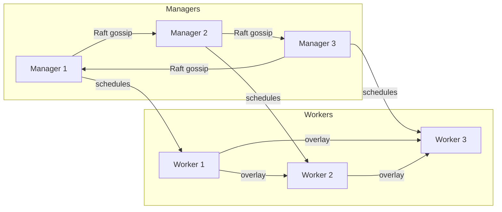

# Docker Swarm: From Beginner to Expert

## About This Guide

Welcome! This guide is a structured, hands-on curriculum that will take you from zero to hero with Docker Swarm. Whether you are a developer looking to run micro-services locally, an operations engineer tasked with production orchestration, or a curious student, the lessons below will incrementally build your knowledge.

* **Format** – 20 concise lessons grouped into four difficulty tiers: Beginner, Intermediate, Advanced, Expert.
* **Prerequisites** – Familiarity with basic Docker CLI (`docker build`, `docker run`, `docker ps`). A machine (or VM) running Linux/macOS/Windows with Docker Engine ≥ 20.10 and at least 4 GB RAM. Most commands work unchanged on any OS; OS-specific notes are marked.
* **Hands-On First** – Each lesson ends with a LAB section containing practical tasks. Try to type every command yourself!
* **Package Manager** – All shell commands assume **pnpm** for Node-based examples (honoring the user rule).

---

## Table of Contents

### 1  Beginner
1. Lesson 1 – What Is Container Orchestration?  
2. Lesson 2 – Installing Docker & Preparing a Lab Environment  
3. Lesson 3 – `docker swarm init`: Bootstrapping Your First Swarm  
4. Lesson 4 – Nodes, Managers, and the Raft Consensus  
5. Lesson 5 – Creating Your First Swarm Service

### 2  Intermediate
6. Lesson 6 – Scaling Services & Performing Rolling Updates  
7. Lesson 7 – Swarm Networking & Load Balancing  
8. Lesson 8 – Persistent Storage with Volumes & Plugins  
9. Lesson 9 – Secret & Config Management  
10. Lesson 10 – Stacks & `docker-compose.yml` v3

### 3  Advanced
11. Lesson 11 – Security Deep Dive & TLS Root CA  
12. Lesson 12 – High Availability & Disaster Recovery  
13. Lesson 13 – Monitoring & Centralized Logging  
14. Lesson 14 – CI/CD Pipelines to Swarm  
15. Lesson 15 – Running Mixed-OS & Multi-Arch Swarms

### 4  Expert
16. Lesson 16 – Autoscaling Strategies & Metrics-Driven Schedulers  
17. Lesson 17 – Federating Multiple Swarms  
18. Lesson 18 – Debugging & Troubleshooting in Production  
19. Lesson 19 – Production Hardening & Best Practices  
20. Lesson 20 – Migration Paths & When to Choose Swarm

---

# Beginner Tier

## Lesson 1 – What Is Container Orchestration?
**Objective**: Understand why tools like Swarm exist.

Container orchestration automates the deployment, scaling, networking and life-cycle of containers. Instead of manually starting containers on individual hosts, an orchestrator turns a group of machines into a single, resilient cluster.

**Key Concepts**
* Cluster, node, scheduler, desired state.
* Swarm vs Kubernetes vs Nomad.

**LAB**
1. Open a terminal and verify Docker is installed:
   ```bash
   docker --version
   ```
2. Read `docker help` to see the `swarm` sub-command.

---

## Lesson 2 – Installing Docker & Preparing a Lab Environment
**Objective**: Set up a multi-node playground on your local machine or in the cloud.

1. **macOS/Linux** – Install Docker Desktop or Docker Engine.
2. **Create 3 VMs with Multipass or Vagrant** (manager + 2 workers) **OR** use cloud instances.
3. Ensure each node can reach the others on ports `2377` (cluster management), `7946` (gossip), and `4789/UDP` (overlay network).

**LAB**
```bash
# Example with Multipass
multipass launch --name manager --cpus 2 --mem 2G
multipass launch --name worker1 --cpus 1 --mem 1G
multipass launch --name worker2 --cpus 1 --mem 1G
```

---

## Lesson 3 – `docker swarm init`: Bootstrapping Your First Swarm
**Objective**: Turn a single machine into a Swarm manager.

```bash
# on the future manager
docker swarm init --advertise-addr <MANAGER_IP>
```
Output includes a join token. Example:
```bash
To add a worker to this swarm, run the following command:
    docker swarm join --token SWMTKN-1-... <MANAGER_IP>:2377
```

**LAB**
1. Join both workers using the command above.
2. Verify:
   ```bash
   docker node ls
   ```

---

## Lesson 4 – Nodes, Managers, and the Raft Consensus
**Objective**: Learn internal mechanics that keep the cluster consistent.

* **Node Roles** – Manager (schedules tasks & stores cluster state) vs Worker (executes tasks).
* **Raft** – Replicated log ensuring *only* a majority of managers can change state.
* **Failover** – If the leader fails, another manager is elected.

**LAB**
1. Promote a worker to manager: `docker node promote <NODE_ID>`.
2. Demote back: `docker node demote <NODE_ID>`.
3. Observe Raft state with `docker info | grep "Raft"`.

---

## Lesson 5 – Creating Your First Swarm Service
**Objective**: Deploy a replicated NGINX service.

```bash
docker service create \
  --name web \
  --replicas 3 \
  -p 80:80 \
  nginx:alpine
```

* Verify tasks: `docker service ps web`.
* Inspect service: `docker service inspect --pretty web`.
* Scale to 5 replicas: `docker service scale web=5`.

**LAB**
1. Curl the manager IP and note round-robin responses.
2. Remove the service: `docker service rm web`.

---

# Intermediate Tier

## Lesson 6 – Scaling Services & Performing Rolling Updates
**Objective**: Change container images with zero downtime.

```bash
docker service update \
  --image nginx:1.25-alpine \
  --update-parallelism 2 \
  --update-delay 10s \
  web
```
* Roll back if issues: `docker service rollback web`.

**LAB**
1. Run an update that intentionally fails (e.g. bad image tag) and observe rollback.

---

## Lesson 7 – Swarm Networking & Load Balancing
**Objective**: Understand ingress & overlay networks.

* **Ingress Network** – Created automatically; implements VIP-based load balancing.
* **Overlay Networks** – User-defined, multi-host.

```bash
docker network create -d overlay --attachable app-net
```

**LAB**
1. Deploy two services on `app-net` and make them talk via service names.

---

## Lesson 8 – Persistent Storage with Volumes & Plugins
**Objective**: Manage stateful services.

* Built-in local volumes vs external drivers (NFS, CIFS, Cloud Block Storage).
* Mounting volumes in a service:

```bash
docker service create \
  --name db \
  --mount type=volume,source=db-data,target=/var/lib/postgresql/data \
  postgres:15-alpine
```

**LAB**
1. Try the same with a driver like `local-persist`.

---

## Lesson 9 – Secret & Config Management
**Objective**: Store sensitive data securely in the Raft log.

```bash
echo "super-secret" | docker secret create pg_pass -
```

```bash
docker service create \
  --name db-secure \
  --secret pg_pass \
  postgres:15-alpine
```

**LAB**
1. Inspect secrets on a worker and notice they are not stored on disk.

---

## Lesson 10 – Stacks & `docker-compose.yml` v3
**Objective**: Deploy multi-service applications declaratively.

`stack.yml`:
```yaml
version: "3.8"
services:
  web:
    image: nginx:alpine
    ports:
      - "80:80"
  api:
    image: node:20-alpine
    command: pnpm start
    depends_on:
      - db
  db:
    image: postgres:15-alpine
    volumes:
      - db-data:/var/lib/postgresql/data
volumes:
  db-data:
```

```bash
docker stack deploy -c stack.yml mystack
```

**LAB**
1. Update the stack and re-deploy.

---

# Advanced Tier

## Lesson 11 – Security Deep Dive & TLS Root CA
**Objective**: Explore how Swarm secures node communication.

* Mutual TLS automatically bootstrapped.
* Root CA rotation: `docker swarm ca --rotate`.
* Encrypting overlay traffic with `--opt encrypted`.

**LAB**
1. Capture packets with `tcpdump` and verify TLS.

---

## Lesson 12 – High Availability & Disaster Recovery
**Objective**: Prepare for node failures.

* **Manager Quorum** – Use odd number of managers (3/5/7).
* **Backups** – `docker swarm join-token --rotate` & `docker swarm unlock-key`.
* Store snapshots of `/var/lib/docker/swarm`.

**LAB**
1. Kill the leader (`docker kill $(docker ps -q --filter name=manager)`) and watch failover.

---

## Lesson 13 – Monitoring & Centralized Logging
**Objective**: Gain visibility.

* Metrics via Prometheus + cAdvisor.
* Logs via Loki or ELK.
* Service-level logs: `docker service logs -f web`.

**LAB**
1. Deploy Prometheus as a Swarm stack and scrape node exporters.

---

## Lesson 14 – CI/CD Pipelines to Swarm
**Objective**: Automate deployments.

* Example GitLab CI job:
```yaml
deploy:
  stage: deploy
  image: docker:20
  services:
    - docker:dind
  script:
    - docker login -u $CI_REGISTRY_USER -p $CI_REGISTRY_PASSWORD $CI_REGISTRY
    - docker stack deploy -c stack.yml mystack
```

**LAB**
1. Build a GitHub Actions workflow that runs `docker service update`.

---

## Lesson 15 – Running Mixed-OS & Multi-Arch Swarms
**Objective**: Combine Linux & Windows or ARM & x86 nodes.

* Constraints & placement preferences:
```bash
docker service create \
  --constraint 'node.platform.os == linux' \
  --constraint 'node.platform.arch == arm64' \
  alpine uname -a
```

**LAB**
1. Add a Raspberry Pi worker and schedule ARM workloads.

---

# Expert Tier

## Lesson 16 – Autoscaling Strategies & Metrics-Driven Schedulers
**Objective**: Implement dynamic scaling.

* Docker Swarm does not auto-scale natively – integrate with:
  * Docker API + Prometheus alerts.
  * OpenFaaS autoscaler.

**LAB**
1. Write a small Node.js script (using `pnpm`) that watches CPU metrics and calls `docker service scale`.

---

## Lesson 17 – Federating Multiple Swarms
**Objective**: Manage several Swarms across regions.

* Tools: Swarm Federation Kit, Interlock, Docker Enterprise (legacy).
* Built-in limitations – consider overlay network reachability.

**LAB**
1. Connect two Swarms with an external load balancer and test service discovery.

---

## Lesson 18 – Debugging & Troubleshooting in Production
**Objective**: Diagnose issues quickly.

* `docker service ps --no-trunc <svc>`.
* `docker inspect --format '{{ .Status.ContainerStatus.ExitCode }}'`.
* Enable debug logs: `--debug` on daemon.

**LAB**
1. Simulate a failure (OOM) and inspect root cause.

---

## Lesson 19 – Production Hardening & Best Practices
**Objective**: Checklist for going live.

1. Use **overlay encryption** & rotated certificates.
2. Keep **manager count odd** and spread across AZs.
3. Store secrets only in Swarm; never build into images.
4. Monitor **Root CA** expiry.
5. Use **resource limits** (`--limit-cpu`, `--limit-memory`).
6. Regularly back up Swarm state & volumes.

---

## Lesson 20 – Migration Paths & When to Choose Swarm
**Objective**: Evaluate Swarm vs alternatives.

* Strengths: Simplicity, Docker-native CLI, smaller footprint.
* Weaknesses: Smaller ecosystem, no native autoscaling, slower feature development.
* Migration to Kubernetes via Kompose, Compose → Helm.

**LAB**
1. Convert `stack.yml` to `helm chart` and deploy to a local K8s cluster (kind/minikube).

---

# Swarm Architecture Diagram (Mermaid)


---

## Further Resources
* Official Docs – https://docs.docker.com/engine/swarm/
* Play With Docker Swarm – https://labs.play-with-docker.com/
* Bret Fisher Docker Mastery Course.
* "Docker Deep Dive" by Nigel Poulton.
* GitHub: https://github.com/docker/awesome-compose (many compose files run on Swarm).

Happy clustering! 🚀
